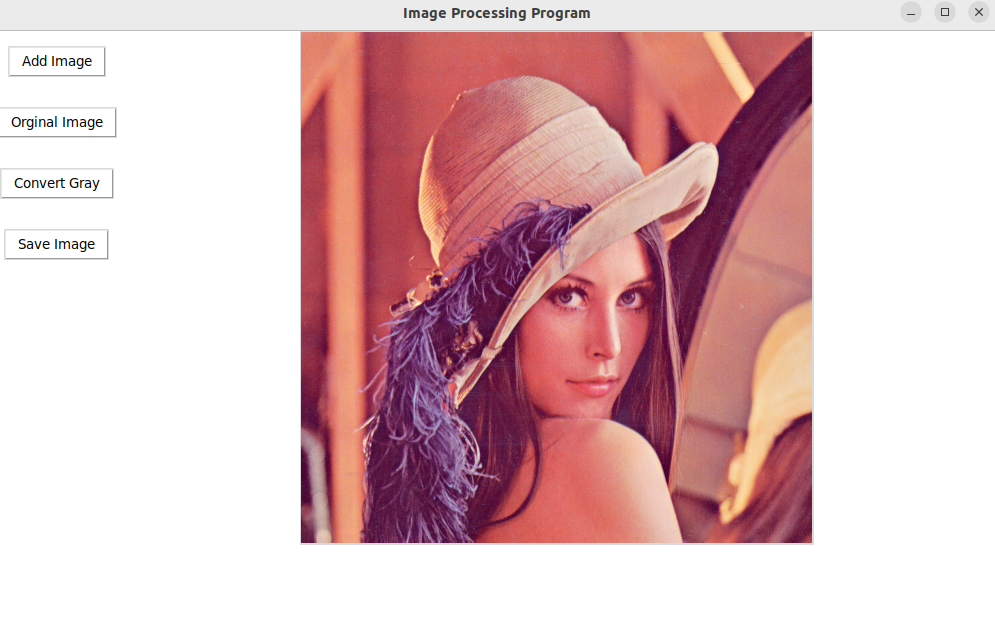
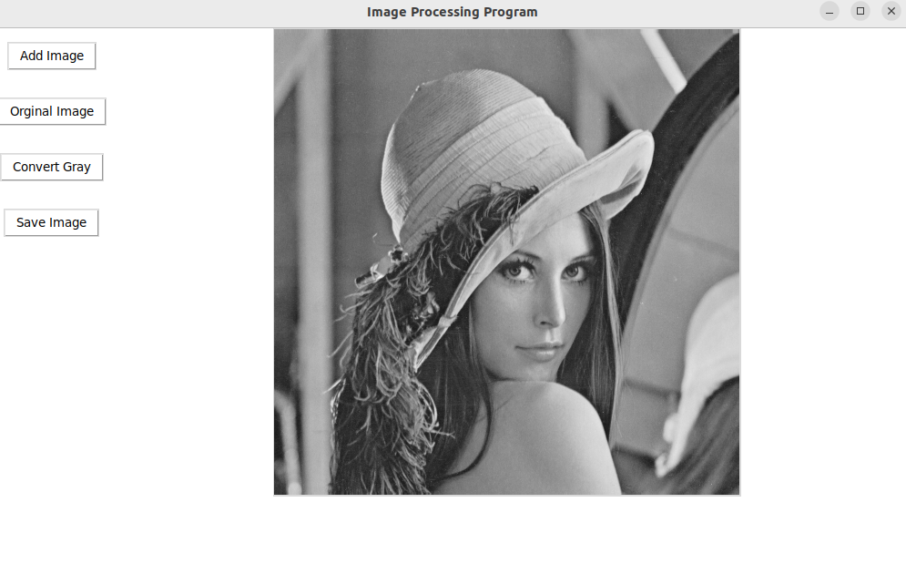

# Image Processing Program GUI

This is a simple GUI for Image Processing Program using Tkinter (For the code in this repo the “Image processing” part is just converting the image of yours choice to grayscale)

 

# 1. Install Tkinter:

- For Ubuntu: `sudo apt install python3-tk`
- For Windows: You gotta figure it out yourself because I don’t use Windows for development stuff

# 2. Run the program:

- On Ubuntu/Linux: `python3 image_pross.py`
- On Windows: As above…

# 3. Screen capture:

